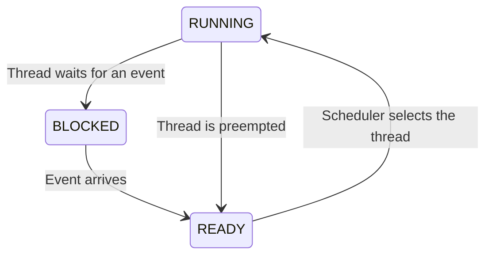

# Lab 2: Pintos

## Overview

In this lab, you will explore the Pintos operating system.

Pintos already implements a simple threading system with:

- thread creation and termination; and
- synchronization primitives, including semaphores, locks, and condition variables.

However, the provided sleep implementation repeatedly yields while checking the elapsed time. This form of busy waiting wastes CPU time.

## Pintos Threading System

The `struct thread` definition in `pintos/src/threads/thread.h` contains the following fields:

```c
struct thread
{
  tid_t tid;                    /* Thread identifier. */
  enum thread_status status;    /* Thread state. */
  char name[16];                /* Name (for debugging purposes). */
  uint8_t *stack;               /* Saved stack pointer. */
  int priority;                 /* Priority. */
  struct list_elem allelem;     /* List element for all-threads list. */

  /* Shared between thread.c and synch.c. */
  struct list_elem elem;        /* List element. */

#ifdef USERPROG
  /* Owned by userprog/process.c. */
  uint32_t *pagedir;            /* Page directory. */
#endif

  /* Owned by thread.c. */
  unsigned magic;               /* Detects stack overflow. */
};
```

Add more fields to this structure as needed.

Threads move between three states:



## Code to Study

Examine the following files:

- `pintos/src/threads/thread.h`
- `pintos/src/threads/thread.c`
- `pintos/src/threads/synch.h`
- `pintos/src/threads/synch.c`

Use them to understand:

- how threads are created and executed;
- how the provided scheduler works; and
- how synchronization primitives such as locks, semaphores, and condition variables are implemented.

## Implementation Suggestions

You may modify existing functions or add your own code in:

- `pintos/src/threads/thread.h`
- `pintos/src/devices/timer.h`
- `pintos/src/devices/timer.c`

Several tests exercise the sleep function in different ways. Run them from `pintos/src/threads`:

```sh
cd pintos/src/threads
make check
```

The tests for Lab 2 are the `alarm-*` tests:

- `alarm-single`
- `alarm-multiple`
- `alarm-simultaneous`
- `alarm-zero`
- `alarm-negative`

A correct solution should pass all of these tests. Ignore the result of `batch-scheduler` for now; that test belongs to Lab 3.

## Submission

Before submitting:

1. Test the code.
2. Write the report.
3. Prepare the archive.
